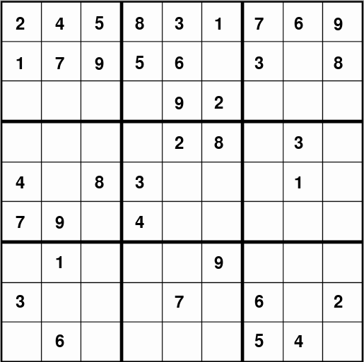

# Sudoku

Simple recursive sudoku solver implemented in python and java

To change the initial sudoku grid just change the array in the file

### Running
```bash
python sudoku.py
```



### Other demos

reimplemented and optimized sudoku solver
```bash
python better_sudoku.py
```
